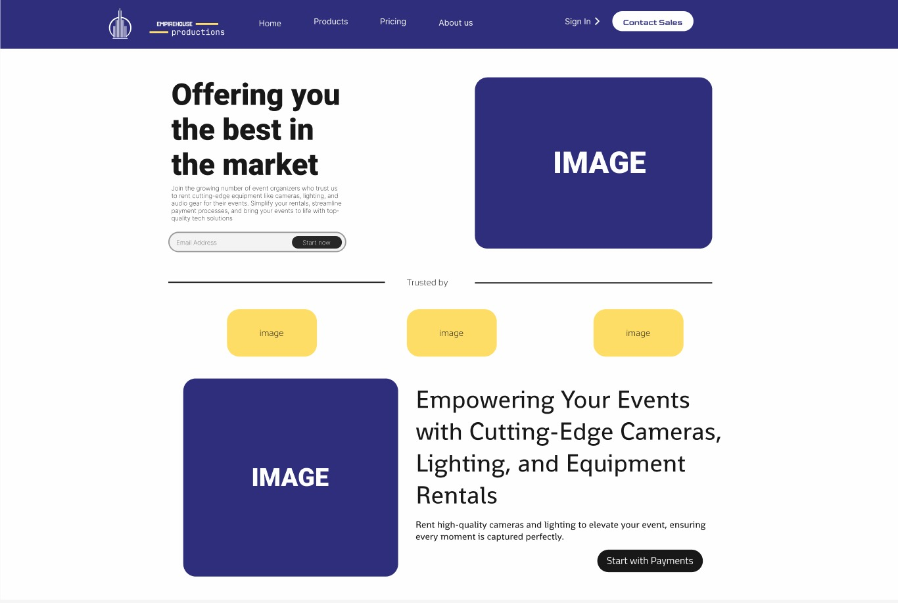

# EmpireHouse Productions Website

**Click To Preview:** <a href="https://www.figma.com/proto/tZUzonM6y9wKvqjLfPP5Ub/Empirehouse-Production-Prototype?t=dxBQboyED6sHpvCq-1"></a>

## Overview

**EmpireHouse Productions** is a premier event production company specializing in **sound, lighting, stage design, and audiovisual (AV) solutions**. We provide state-of-the-art production services for concerts, corporate events, weddings, theatrical performances, and more. Our team is dedicated to delivering immersive and seamless experiences by leveraging cutting-edge technology and professional expertise.

### Purpose

EmpireHouse Productions was created to revolutionize event production by offering top-tier **sound engineering, lighting effects, stage setup, and AV solutions**. We ensure that every event—whether big or small—receives high-quality production value, enhancing both aesthetics and functionality.

## Features

- 🎤 **Custom Sound Systems:** High-fidelity audio setups tailored for different venues and event sizes.
- 🎭 **Advanced Lighting Solutions:** Dynamic lighting effects, intelligent lighting controls, and custom-designed atmospheres.
- 🎬 **Professional Stage Design:** Modular and customizable stage setups for concerts, conferences, and performances.
- 📺 **High-Quality Audiovisual (AV) Integration:** Seamless projection mapping, LED screens, and video playback.
- 📅 **Event Planning & Execution:** Full-service event production, including pre-event planning, setup, live operation, and teardown.
- 🎥 **Live Streaming Capabilities:** High-definition streaming for virtual and hybrid events.
- 📲 **Mobile-Friendly Booking System:** Easy online scheduling and booking through the website.
- 🖥 **Client Dashboard:** Manage bookings, request quotes, and review past projects.

## Technologies Used

```yaml
Frontend:  HTML5, CSS3, JavaScript, React.js
Backend:   Node.js, Express.js
Database:  MongoDB
Auth:      Firebase Auth / JWT
Hosting:   Vercel / Netlify
Payments:  Visa / PayPal
```

## Installation

To set up the project locally, follow these steps:

```bash
# Clone the repository
git clone https://github.com/your-username/empirehouse-productions.git

# Navigate to the project directory
cd empirehouse-productions

# Install dependencies
npm install

# Start the development server
npm start
```

## Usage

1. **Browse Services:** Explore our sound, lighting, stage, and AV services.
2. **Request a Quote:** Submit details about your event to get a customized quote.
3. **Book a Service:** Secure your event production services through our online booking system.
4. **Manage Your Events:** Log in to view your bookings, invoices, and past projects.
5. **Live Event Support:** Our team provides real-time support during your event to ensure flawless execution.

## Contributors


- **Lungelwa Mazibuko** (https://github.com/LungelwaMazibuko) - Lead Developer
- **Mzwandile Dlamini** (https://github.com/ST10295952) - UI/UX Designer
- **Asemahle Nonkwelo** (https://github.com/AsemahleNonkwelo) - Project Manager
- **Makaphile Jula** (https://github.com/Makaphile) - Bussiness Analyst
- **Vulemusini** (https://github.com/Velemuseni) - Content Creator
- **Mongezi** (https://github.com/Mongezi2003) - Quality Assurance


## License

This project is licensed under the [MIT License](LICENSE).

## Contact

For any questions, service inquiries, or bookings, visit our website at [**EmpireHouse Productions Official Site**](YOUR_WEBSITE_URL).

